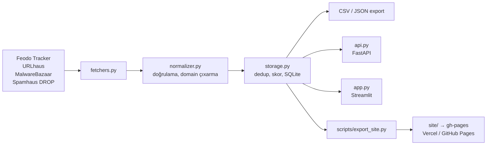

# 🛡️ OSINT IOC Collector

Açıq mənbələrdən (API açarı və qeydiyyat tələb etməyən feed-lərdən) təhdid indikatorlarını (IOC) avtomatik toplayan, normallaşdıran, dublikatlardan təmizləyən, risk skoru verən və CSV/JSON formatında təqdim edən yüngül platforma.

> **Holberton School Azerbaijan** · Final Project (C.5 OSINT IOC Collector, No API Keys)

**🌐 Canlı sayt:** [osint-ioc-collector-indol.vercel.app](https://osint-ioc-collector-indol.vercel.app) · [GitHub Pages](https://hasanoffh.github.io/osint-ioc-collector/)

---

## 📑 Mündəricat
1. [Layihə haqqında](#-layihə-haqqında)
2. [Əsas xüsusiyyətlər](#-əsas-xüsusiyyətlər)
3. [Arxitektura](#-arxitektura)
4. [Data mənbələri](#-data-mənbələri)
5. [IOC tipləri və schema](#-ioc-tipləri-və-schema)
6. [Risk skorlaması](#-risk-skorlaması)
7. [Quraşdırma və işə salma](#-quraşdırma-və-işə-salma)
8. [Avtomatlaşdırma](#-avtomatlaşdırma)
9. [Datanı necə əldə etmək olar](#-datanı-necə-əldə-etmək-olar)
10. [Layihə strukturu](#-layihə-strukturu)
11. [Sənədləşmə](#-sənədləşmə)
12. [Komanda](#-komanda)
13. [Məhdudiyyətlər və məsuliyyət](#-məhdudiyyətlər-və-məsuliyyət)

---

## 📌 Layihə haqqında

Kiçik SOC komandaları, startaplar və tələbələr üçün keyfiyyətli threat intelligence əldə etmək çətindir və bahalıdır. Açıq feed-lər isə fərqli formatlarda paylanır, təkrarlanan və köhnəlmiş qeydlər ehtiva edir.

Bu layihə həmin feed-ləri bir yerdə toplayır və SIEM/firewall qaydaları üçün hazır, təmiz IOC bazasına çevirir.

| | |
|---|---|
| **Məqsəd** | Açıq feed-lərdən IOC-ləri toplamaq və aşağı axın (downstream) istifadə üçün normallaşdırmaq |
| **Texnologiyalar** | Python, requests, SQLite, FastAPI, Streamlit, Docker, GitHub Actions |
| **Çıxışlar** | Skriptlər, normallaşdırılmış dataset, feed map, istifadəçi bələdçisi, canlı sayt |

## 🚀 Əsas xüsusiyyətlər

- **Çoxmənbəli toplama:** Feodo Tracker, URLhaus, MalwareBazaar, Spamhaus DROP
- **Normalizasiya:** `ip`, `url`, `domain`, `sha256`, `cidr` tipləri üçün vahid schema, doğrulama və təmizləmə
- **Deduplikasiya:** eyni IOC bir sətirdə birləşir, mənbələr ayrıca `ioc_sources` cədvəlində izlənir
- **Dinamik risk skoru (0-100):** mənbə etibarlılığı, təsdiq edən mənbə sayı, davamlılıq və köhnəlmə (aging) nəzərə alınır
- **Zaman izləmə:** hər IOC üçün `first_seen`, `last_seen`, `seen_count`
- **Export:** CSV və JSON
- **Loglama:** fayla (rotasiya ilə) və konsola
- **Avtomatlaşdırma:** GitHub Actions ilə hər saat toplama və sayt yeniləməsi
- **İctimai sayt:** axtarış, filtr və endirmə, quraşdırma tələb etmir
- **REST API və dashboard:** FastAPI və Streamlit (lokal və ya Docker ilə)

## 🏗️ Arxitektura



**Yerləşdirmə:**

| Hissə | Harada |
|---|---|
| Kod | `main` branch |
| Saatlıq toplama | GitHub Actions (`.github/workflows/collect.yml`) |
| Canlı DB (`iocs.db`) | `data` branch (hər run-da üzərinə yazılır) |
| İctimai sayt və data faylları | `gh-pages` branch → Vercel / GitHub Pages |

## 📡 Data mənbələri

| Feed | Gətirdiyi IOC | Format |
|---|---|---|
| [Feodo Tracker](https://feodotracker.abuse.ch/) | Botnet C2 IP-ləri | JSON |
| [URLhaus](https://urlhaus.abuse.ch/) | Zərərli URL-lər (və onlardan domenlər) | JSON |
| [MalwareBazaar](https://bazaar.abuse.ch/) | Zərərli fayl SHA256 hash-ləri | Text |
| [Spamhaus DROP](https://www.spamhaus.org/drop/) | Zərərli şəbəkə blokları (CIDR) | NDJSON / Text |

Ətraflı məlumat (URL-lər, yenilənmə tezliyi, lisenziya, sahə xəritəsi): [`docs/feed_map.md`](docs/feed_map.md).

## 🧬 IOC tipləri və schema

| Tip | Nümunə | Mənbə |
|---|---|---|
| `ip` | `203.0.113.5` | Feodo Tracker |
| `url` | `http://example.test/a.exe` | URLhaus |
| `domain` | `example.test` | URLhaus (URL-dən çıxarılır) |
| `sha256` | `e3b0c442...` | MalwareBazaar |
| `cidr` | `192.0.2.0/24` | Spamhaus DROP |

**Əsas sahələr:** `ioc_type`, `value`, `risk_score`, `sources`, `source_count`, `seen_count`, `first_seen`, `last_seen`, `description`.

Legitim platformaların (məs. `github.com`, `drive.google.com`) domenləri false-positive yaratmasın deyə domen IOC-lərindən çıxarılır. Tam schema: [`docs/feed_map.md`](docs/feed_map.md).

## 🎯 Risk skorlaması

```
skor = 20
     + ən etibarlı mənbənin çəkisi          (Feodo 40, Spamhaus 35, URLhaus 30, MalwareBazaar 30)
     + 15 × (əlavə mənbə sayı)
     + 2  × (əlavə görünmə sayı, maks. 10)
     − 2  × (son görünmədən keçən gün, maks. 40)
```
Nəticə 0-100 aralığına salınır. Ətraflı izah: [`docs/user_guide.md`](docs/user_guide.md#4-risk-skoru-necə-hesablanır).

## 🛠️ Quraşdırma və işə salma

Tələblər: Python 3.9+, internet bağlantısı.

### Rejim 1: Lokal (Python)

```bash
git clone https://github.com/hasanoffh/osint-ioc-collector.git
cd osint-ioc-collector
python3 -m venv venv
source venv/bin/activate          # Windows: venv\Scripts\activate
pip install -r requirements.txt
```

Datanı toplayın:
```bash
python3 main.py                   # DB və export faylları (data/)
python3 main.py --sample          # əlavə olaraq sample_data/ yaradır
```

API və dashboard:
```bash
uvicorn api:app --host 0.0.0.0 --port 8000     # Swagger: http://localhost:8000/docs
streamlit run app.py                            # http://localhost:8501
```

### Rejim 2: Docker

```bash
docker-compose up -d --build
```

| Xidmət | Ünvan |
|---|---|
| Streamlit dashboard | http://localhost:8501 |
| FastAPI (Swagger UI) | http://localhost:8000/docs |

## ⚙️ Avtomatlaşdırma

**GitHub Actions (əsas yol):** `.github/workflows/collect.yml` hər saat `main.py`-ı işlədir, sayt datasını yaradır və `gh-pages` branch-ına yayır. DB runlar arasında `data` branch-ında saxlanılır. Əl ilə işə salmaq üçün: **Actions → collect-and-publish → Run workflow**.

**Cron (lokal alternativ, Linux/macOS):**
```cron
0 * * * * cd /path/to/osint-ioc-collector && /path/to/venv/bin/python main.py >> data/cron.log 2>&1
```
Windows üçün Task Scheduler istifadə edin. Təlimat: [`docs/user_guide.md`](docs/user_guide.md#3-avtomatik-işləmə).

## 📥 Datanı necə əldə etmək olar

**Brauzerdən:** canlı sayta daxil olub axtarın, süzün və CSV/JSON endirin.

**Proqramla (statik fayllar):**
```bash
BASE=https://osint-ioc-collector-indol.vercel.app

curl -s $BASE/data/stats.json                 # ümumi statistika
curl -s $BASE/data/ip.json   -o ip.json       # tip üzrə JSON
curl -s $BASE/data/url.csv   -o url.csv       # tip üzrə CSV
```
Mövcud tiplər: `ip`, `url`, `domain`, `sha256`. JSON-da hər sətir `[value, score, sources, seen_count, first_seen, last_seen, description]` formatındadır.

**REST API (lokal/Docker):**

| Endpoint | Təsvir |
|---|---|
| `GET /api/v1/iocs` | IOC siyahısı (tip və skor üzrə filtr, `/docs`-a baxın) |
| `GET /api/v1/stats` | Tip üzrə statistika |

**Nümunə dataset:** [`sample_data/`](sample_data/) qovluğunda.

## 📁 Layihə strukturu

```
osint-ioc-collector/
├── main.py                 # Toplama → normalizasiya → saxlama → export (giriş nöqtəsi)
├── fetchers.py             # Feed-lərdən xam data çəkir (retry, timeout, logging)
├── normalizer.py           # Vahid schema, doğrulama, domain çıxarma
├── storage.py              # SQLite, dedup, skorlama, CSV/JSON export, sample
├── api.py                  # FastAPI REST API
├── app.py                  # Streamlit dashboard
├── scripts/
│   └── export_site.py      # İctimai sayt üçün data faylları yaradır
├── site/
│   ├── index.html          # Statik sayt
│   └── vercel.json         # CORS başlıqları
├── .github/workflows/
│   └── collect.yml         # Saatlıq toplama və yayım
├── docs/
│   ├── feed_map.md         # Feed xəritəsi və schema
│   └── user_guide.md       # İstifadəçi bələdçisi
├── sample_data/            # Nümunə dataset (CSV, JSON)
├── Dockerfile
├── docker-compose.yml
├── requirements.txt
└── README.md
```
İcra zamanı yaranan `data/` qovluğu (SQLite DB, export və log faylları) `.gitignore`-dadır.

## 📚 Sənədləşmə

| Sənəd | Məzmun |
|---|---|
| [`docs/feed_map.md`](docs/feed_map.md) | Feed-lər, URL, format, tezlik, lisenziya, sahə xəritəsi, schema |
| [`docs/user_guide.md`](docs/user_guide.md) | Quraşdırma, işə salma, scoring, export, troubleshooting |

## 👥 Komanda

| Üzv | Rol |
|---|---|
| İlqar Həsənov | Cyber / Backend |
| Rəhimə Hətəmova | Data Engineering |
| Ümid Nağıyev | Threat Intelligence |
| Fidan Aslanova | QA & Documentation |

## ⚠️ Məhdudiyyətlər və məsuliyyət

- Data məlumat məqsədlidir. Risk skoru avtomatik hesablanır və **false-positive ola bilər**. Bloklama qaydalarına əlavə etməzdən əvvəl yoxlayın.
- İctimai saytda **Spamhaus DROP datası yayılmır** (mənbənin istifadə şərtlərinə görə). Lokal işə salanda Spamhaus da toplanır.
- URLhaus URL-ləri mətn kimi göstərilir, kliklənən link deyil. Zərərli ünvanları brauzerdə açmayın.
- Feed-lərin formatı və əlçatanlığı dəyişə bilər, bunun üçün `data/collector.log` və Actions loglarına baxın.
- Data mənbələri: abuse.ch (CC0), Spamhaus (öz şərtləri tətbiq olunur). Hər mənbənin lisenziyasını [`docs/feed_map.md`](docs/feed_map.md)-də yoxlayın.
